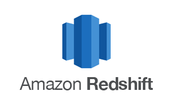

# Hi there 👋 I am Mike Solty. 

Thanks for checking out my github!

Somehow over the last few years I have stumbled from pizza delivery to Data Science @ Shopify.

Must have taken a wrong turn on my last delivery? 

But in all seriousness, I ended up here likely due to being a very curious guy and as it turns out especially so, for the businesses that I work with, and the problems which we work through. Once I realized I needed SQL to be able to answer my curiosities I was absolutely hooked. A few years later, a couple thousand queries, a few pipelines, etc. - and here we are! 

## Some things I am proud of

- Acted as the financial sales team data partner to help improve processes and find effincies. Over the years we went from terrible spreadsheets to a terrible salesforce (was a surprisingly long road to get there).
- Developped key reports for tracking sales metrics and helping leadership better understand our financial products.
- Found some huge inconsistencies with our financial products (some of which led to millions of dollars of revenue being created).
- Developped impactful data stories (I was a key contributor on developing the sales story for [Shop](https://shop.app/what-shop-does).

Beyond that I have worked across many parts of the company, and like to think I have had a huge impact on Shopify, as a result on entreprenuership, and even the environment (thanks to [Shop!](https://shop.app/carbon-offsetting)).

I feel blessed to do the work I do everyday and am so excited about the field of Data Science. 🙏

## Some quick facts about me...

Currently I am based in: Kelowna, BC, Canada 🇨🇦

I absolutely love to travel ✈️

mainly to 🏄 🏂

I treeplanted for 4 years through university and have planted over half a million trees 🌴

## 🧰 My Current Toolbox Contains
             
